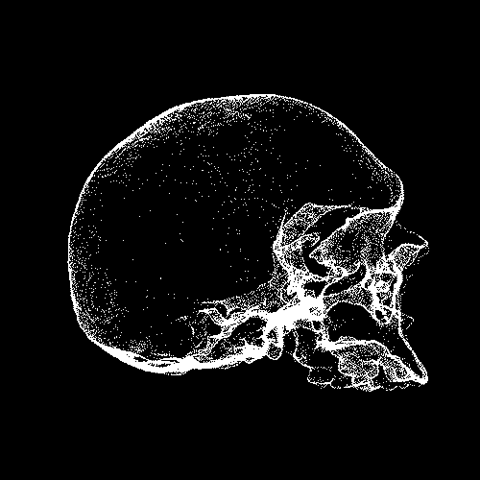

<div align="left">



<p>
  
<p>

<pre style="font-size:16px; line-height:1.6; color:#39FF14; background-color:#000000; border:1px solid #39FF14; padding:15px; border-radius:10px;">

> Daniel
> Software Engineering Student
> Offensive Security Enthusiast
> Linux User
> Python Automation
> Cybersecurity Researcher

</pre>

<div align="left">

<code>

███████╗████████╗██╗  ██╗██╗ ██████╗ █████╗ ██╗
██╔════╝╚══██╔══╝██║  ██║██║██╔════╝██╔══██╗██║
█████╗     ██║   ███████║██║██║     ███████║██║
██╔══╝     ██║   ██╔══██║██║██║     ██╔══██║██║
███████╗   ██║   ██║  ██║██║╚██████╗██║  ██║███████╗
╚══════╝   ╚═╝   ╚═╝  ╚═╝╚═╝ ╚═════╝╚═╝  ╚═╝╚══════╝

██╗  ██╗ █████╗  ██████╗██╗  ██╗██╗███╗   ██╗ ██████╗
██║  ██║██╔══██╗██╔════╝██║ ██╔╝██║████╗  ██║██╔════╝
███████║███████║██║     █████╔╝ ██║██╔██╗ ██║██║  ███╗
██╔══██║██╔══██║██║     ██╔═██╗ ██║██║╚██╗██║██║   ██║
██║  ██║██║  ██║╚██████╗██║  ██╗██║██║ ╚████║╚██████╔╝
╚═╝  ╚═╝╚═╝  ╚═╝ ╚═════╝╚═╝  ╚═╝╚═╝╚═╝  ╚═══╝ ╚═════╝

</code>

</div>

</div>

[](https://git.io/typing-svg)

---

## `> Tech Stack`

```bash
root@daniel:~$ ls ./tech_stack
```

<br>

<div align="left">


</div>

<br>

<p align="center">
  
</p>
